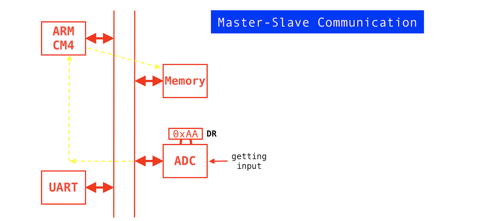
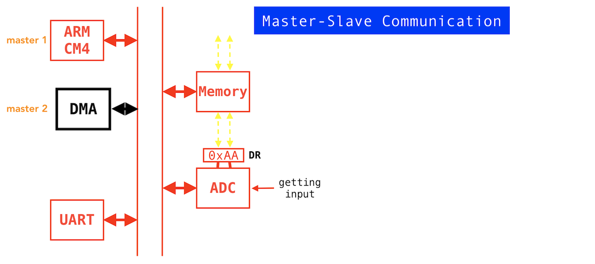

# ARM Cotex M DMA (Direct memory access)    
     
 To understand DMA, assume we have a ADC peripheral and its job is to digitize the analog signal (which is given as an input).     
- It starts calculating and when operation completes. It has its own register called data register _DR_ and there it will store the value `0xAA`.        
- Now the peripheral is ready with the data and it has to be moved to the memory. You write some instructions to copy that data from the peripheral DR into the memory. In turn, ARM executes a _load instruction_ **LDR** to read the data from DR of ADC peripheral (as every data registers have its own address) into the internal register the processor.        
- And finally it uses _store instruction_ **STR** to load the value from internal register into the memory (As shown by yellow dotted lines below)     
      
         
    
Now, here you can ask one question. Why that path is required? (shown with yellow dotted lines). Why can't the ADC just push that data into the memory rather going all the way through the processor?       
The answer is, it's not possible, even though the ADC is connected to the bus, the ADC doesn't come with that intelligence to generate  bus transactions and the control signals to move data from one location to another.     
That's why we call anyone who can take over the bus to generate all those bus transactions (As ARM processor) to move data from one place to another is called master.      
Similarly, ARM is a bus Master, that it has the intelligence to take over to generate bus transactions. On the other hand, anything else which doesn't have the ability is called Slave. Hence, whenever the data is ready with the slave a master has to move it. Other word, a slave cannot move the data asynchronously. However a slave can generate asynchronous events to indicate the processor that hey I have a data that's you call an interrupt. But, a slave cannot generate bus transactions to move data from one part of the microcontroller to another. Hence the ADC, UART etc all are called slaves. Whereas the processor is called a bus master or a master.     
       
Now the question is, Can we offload this task of data transfer from processor to someone else?      
     
For that, the manufacturers have come up with solution called Direct Memory Access controller **DMA** controller. This is also a master. We can say that processor is master 1 and DMA is master 2. And DMA is also hanging on the bus and it has the intelligence to create all the bus transactions to take over the bus to move data from _Peripherals to Peripheral_, _Peripheral to Memory_, _Memory to the Peripheral_, or you can even do _Memory to Memory_ data transfer without taking the help of ARM. It's like offloading the data transfer work to another controller, that is the DMA controller.      

           
      
> [!NOTE]      
> Remember, that the DMA controller won't execute any instruction in your microcontroller. And processor is the only master which has the capacity to execute instructions. Hencem DMA only has a logic implemented in the hardware to take over the bus and to do the data transfer from _Peripherals to Peripheral_, _Peripheral to Memory_ etc.

    
